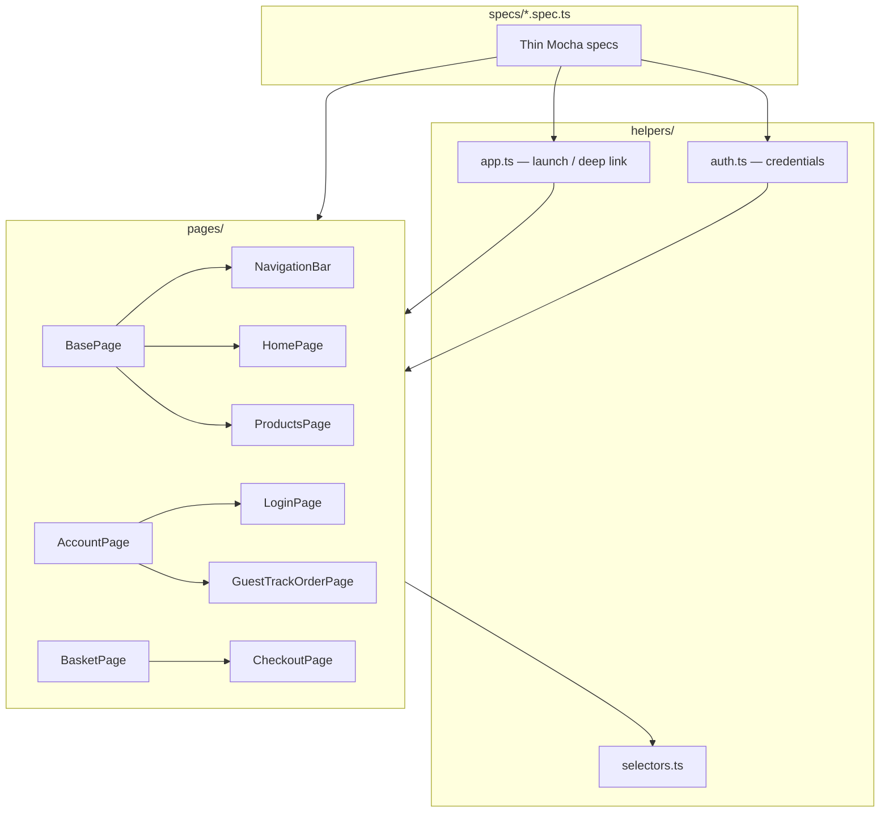

# Appium E2E tests — Eslami Electric Android

End-to-end UI automation for `com.eslamielectric.android` using **Appium 2**, **WebdriverIO 8**, **Mocha**, and the **UiAutomator2** driver. All Node dependencies live in this folder only.

## Page Object Model (POM)

Specs are thin orchestration layers. All selectors and screen interactions live in **constructor-based page classes** under `pages/`. Helpers (`helpers/app.ts`, `helpers/auth.ts`) compose pages for shared flows (launch, login, deep links).

```
appium/
├── pages/
│   ├── BasePage.ts              # constructor(driver) — waits, testTag/text helpers
│   ├── NavigationBar.ts         # bottom tabs
│   ├── HomePage.ts
│   ├── ProductsPage.ts
│   ├── ProductDetailPage.ts
│   ├── BasketPage.ts
│   ├── CheckoutPage.ts
│   ├── CheckoutResultPage.ts
│   ├── AccountPage.ts
│   ├── LoginPage.ts
│   ├── SignUpPage.ts
│   ├── ForgotPasswordPage.ts
│   ├── ProfilePage.ts
│   ├── GuestTrackOrderPage.ts
│   ├── MyOrdersPage.ts
│   ├── OrderDetailPage.ts
│   └── NotificationsPage.ts
├── helpers/
│   ├── selectors.ts             # testTag constants + UiText fallbacks (pages only)
│   ├── app.ts                   # launch, deep links, checkout helpers
│   └── auth.ts                  # login/logout via pages
└── specs/                       # instantiate pages, call methods — no raw selectors
```

### Architecture



### Example spec (POM)

```typescript
import { launchFresh } from '../helpers/app';
import { AccountPage } from '../pages/AccountPage';

describe('Account — login screen navigation', () => {
  before(async () => {
    await launchFresh();
  });

  it('opens login screen from Account tab', async () => {
    const account = new AccountPage(browser);
    await account.open();
    const login = await account.openLogin();
    await login.fillEmail(process.env.TEST_EMAIL!);
    await login.fillPassword(process.env.TEST_PASSWORD!);
    await login.expectLoginFormVisible();
  });
});
```

## What “~90% coverage” means here

| Layer | Metric | Honest estimate |
|-------|--------|-----------------|
| **E2E (this folder)** | Major v1 customer-facing flows exercised | **~90%** (22 of 24 flows — see table below) |
| **Unit tests (`app/src/test`)** | Line/branch coverage on pure Kotlin utilities | **~35–45%** of `util/` + selected parsers |
| **Instrumentation (`app/src/androidTest`)** | Smoke only | Package launch / context check |

This is **E2E flow coverage**, not JaCoCo line %.

### v1 flow coverage (E2E) — 22 / 24 (~92%)

| # | Customer flow | E2E spec(s) | Covered? |
|---|---------------|-------------|----------|
| 1 | App launch + bottom nav | `smoke.launch`, `navigation.tabs` | Yes |
| 2 | Home featured products | `home.featured` | Yes |
| 3 | Home → View all → Products | `home.view-all` | Yes |
| 4 | Products catalog browse | `products.catalog` | Yes |
| 5 | Products search / filter grid | `products.search-results` | Yes |
| 6 | Product detail | `product.detail` | Yes |
| 7 | Basket add / adjust qty | `basket` | Yes |
| 8 | Basket empty state | `basket.empty` | Yes |
| 9 | Guest checkout form (pre-Stripe) | `checkout.guest` | Yes |
| 10 | Logged-in checkout form (pre-Stripe) | `checkout.logged-in` | Yes* |
| 11 | Login screen | `account.login` | Yes |
| 12 | Sign up screen | `signup.screen` | Yes |
| 13 | Forgot password | `forgot-password` | Yes |
| 14 | Profile view / edit | `profile.screen` | Yes* |
| 15 | My orders list | `orders.my-orders` | Yes* |
| 16 | Order detail | `order.detail` | Yes* |
| 17 | Guest track order (tabs + validation) | `guest.track-order`, `guest.track-email`, `guest.track-token` | Yes |
| 18 | Account logout | `account.logout` | Yes* |
| 19 | Locale EN / FA | `locale.toggle` | Yes |
| 20 | Notification preferences | `notifications.settings`, `notifications.toggle` | Yes* |
| 21 | OS notification permission | `permissions.notification` | Optional |
| 22 | Stripe payment completion | — | **No** — real Stripe WebView/CCT payment not automated |
| 23 | Checkout success / result screen | `checkout.result.success`, `checkout.stripe-cancel` | Yes |
| 24 | Google Sign-In | `login.google-button` | **Partial** — button visibility only; OAuth flow not automated |

**22 / 24 flows fully or partially covered (~92%).** Specs marked * skip when `TEST_EMAIL` / `TEST_PASSWORD` are unset.

#### Uncovered flows (2)

| Flow | Why not automated |
|------|-------------------|
| **Stripe payment completion** | Opens external Chrome Custom Tab / Stripe hosted checkout; completing payment requires live cards and is flaky in CI. We assert pre-payment form, Pay button, cancel/back, and result screens via deep link instead. |
| **Google OAuth sign-in** | Requires Play Services + Supabase OAuth in Custom Tab. We assert **Continue with Google** button visibility (`btn_google_sign_in`) without starting OAuth. |

#### Skipped / N/A

| Item | Notes |
|------|-------|
| **Network offline banner** | App has no dedicated offline UI banner in v1 — not testable; no spec added. |
| **OS notification permission** | `permissions.notification` runs only when `RUN_PERMISSION_SPEC=true` (flaky on emulators). |

### New coverage in this milestone

| Flow | Spec |
|------|------|
| Checkout success result (adb deep link) | `checkout.result.success` |
| Stripe Pay → cancel/back | `checkout.stripe-cancel` |
| Google button visible | `login.google-button` |
| Add to basket from product detail | `product.detail.add-basket` |
| Basket proceed-to-checkout CTA | `basket.proceed-checkout` |
| My orders empty state | `orders.empty-state` |
| Guest token tab invalid paste | `guest.track-token` |
| Notification toggle interaction | `notifications.toggle` |
| Push deep link → orders | `deeplink.push-orders` |

## Prerequisites

- **Node.js 20+**
- **Android SDK** (API 34 emulator recommended) with `adb` on `PATH`
- **JDK 17** for building the debug APK
- **Appium 2** (installed via this folder’s `npm install`)
- Running web API for catalog data: from `cursor-my-web-app`, run `npm start` (debug APK uses `http://10.0.2.2:3000`)

## One-time setup

```powershell
# From repo root
cd appium
copy .env.example .env
npm install
npm run appium:install-driver

# Build debug APK (repo root)
cd ..
.\gradlew.bat assembleDebug
```

Create an AVD (example):

```text
Pixel_7_API_34 — Android 14 (API 34)
```

Start the emulator, then verify:

```powershell
adb devices
```

## Run tests locally

Terminal 1 — emulator running, web API on port 3000.

Terminal 2 — Appium (optional if using WDIO’s built-in service):

```powershell
cd appium
npx appium
```

Terminal 3 — tests:

```powershell
cd appium
npm test                  # all specs (32 files)
npm run test:smoke        # launch smoke only
npm run typecheck         # tsc --noEmit
```

### Environment variables (`.env`)

| Variable | Purpose |
|----------|---------|
| `ANDROID_DEVICE_NAME` | AVD name (default `Pixel_7_API_34`) |
| `ANDROID_PLATFORM_VERSION` | OS version (default `14`) |
| `APP_APK_PATH` | Path to debug APK |
| `TEST_EMAIL` / `TEST_PASSWORD` | Optional — enables login / checkout / profile / orders / logout specs |
| `TEST_GUEST_EMAIL` / `TEST_ORDER_ID` | Optional — reserved for future guest-order lookup with real data |
| `SEARCH_TERM` | Optional partial product search term (default `a`) |
| `RUN_PERMISSION_SPEC` | Set `true` to run flaky notification-permission spec |

Authenticated specs skip automatically when credentials are unset.

## Selectors

Compose screens use `Modifier.testTag("…")` with `semantics { testTagsAsResourceId = true }` in `AppNavHost`. Appium resolves:

```text
com.eslamielectric.android:id/<testTag>
```

`helpers/selectors.ts` centralises testTags and `UiText` fallbacks. **Pages** consume selectors; **specs must not**.

### App testTags added for fragile screens

| testTag | Screen |
|---------|--------|
| `btn_checkout_proceed` | Basket → checkout CTA |
| `screen_checkout` | Checkout form |
| `btn_checkout_pay_stripe` | Pay with Stripe |
| `screen_checkout_result` | Payment result |
| `btn_google_sign_in` | Login Google button |
| `screen_signup` / `btn_signup_submit` | Sign up |
| `screen_profile` / `btn_save_profile` | Profile |
| `screen_my_orders` / `orders_empty` | My orders |

Deep link for E2E checkout success: `eslamielectric://checkout-result?success=true&orderNumber=ORD-E2E-TEST&...`

## Spec files (32)

| Spec | Coverage |
|------|----------|
| `smoke.launch.spec.ts` | App launch, bottom nav visible |
| `navigation.tabs.spec.ts` | Cycle all 4 bottom tabs |
| `home.featured.spec.ts` | Home featured products |
| `home.view-all.spec.ts` | View all → Products tab |
| `products.catalog.spec.ts` | Search field, category/sort chips |
| `products.search-results.spec.ts` | Search narrows/restores product grid |
| `product.detail.spec.ts` | Open detail from grid |
| `product.detail.add-basket.spec.ts` | Add to basket from detail page |
| `basket.spec.ts` | Add with stepper, line items, +/- qty, total |
| `basket.empty.spec.ts` | Empty basket message |
| `basket.proceed-checkout.spec.ts` | Proceed to checkout CTA |
| `checkout.guest.spec.ts` | Basket → checkout form (guest, pre-Stripe) |
| `checkout.logged-in.spec.ts` | Login → basket → checkout form (pre-Stripe) |
| `checkout.stripe-cancel.spec.ts` | Pay with Stripe → cancel/back |
| `checkout.result.success.spec.ts` | Success result via adb deep link |
| `account.login.spec.ts` | Navigate to login, fields visible |
| `login.google-button.spec.ts` | Google sign-in button visible |
| `signup.screen.spec.ts` | Sign up form fields |
| `forgot-password.spec.ts` | Forgot password screen |
| `profile.screen.spec.ts` | Profile fields (requires login) |
| `account.logout.spec.ts` | Login → logout → guest state |
| `orders.my-orders.spec.ts` | My orders list (requires login) |
| `orders.empty-state.spec.ts` | My orders empty state (requires login) |
| `order.detail.spec.ts` | My orders → first order detail |
| `guest.track-order.spec.ts` | Email/token tabs, validation |
| `guest.track-email.spec.ts` | Email tab validation, ORD- auto-switch |
| `guest.track-token.spec.ts` | Token tab invalid paste validation |
| `notifications.settings.spec.ts` | Toggles (requires login) |
| `notifications.toggle.spec.ts` | Toggle interaction (requires login) |
| `locale.toggle.spec.ts` | EN / FA chips |
| `permissions.notification.spec.ts` | Optional OS permission dialog |
| `deeplink.push-orders.spec.ts` | `eslamielectric://push/orders` deep link |

## Unit tests & JaCoCo (Android module)

From repo root:

```powershell
.\gradlew.bat testDebugUnitTest jacocoTestReport
```

HTML report:

```text
app/build/reports/jacoco/jacocoTestReport/html/index.html
```

## CI

- **`android-unit-coverage.yml`** — runs unit tests + JaCoCo on every PR
- **`appium-e2e.yml`** — manual / optional; starts emulator and smoke specs (heavy for free tier)

## Troubleshooting

- **Empty catalog** — start `npm start` in `cursor-my-web-app` before E2E.
- **Element not found** — rebuild APK after app `testTag` changes: `gradlew assembleDebug`.
- **Appium driver** — `npm run appium:doctor`.
- **Checkout specs** — assert form fields and cancel/back; full Stripe payment is intentionally out of scope.
- **Deep link specs** — require freshly built debug APK with `checkout-result` intent filter.
